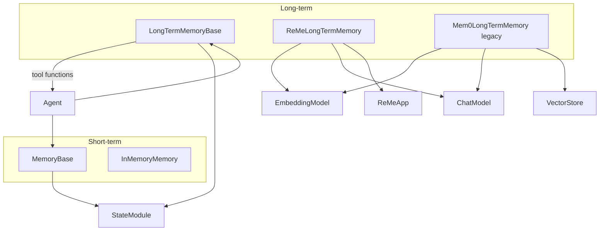

# SOP：src/agentscope/memory 模块

## 一、功能定义（Scope/非目标）
### 1. 设计思路和逻辑
- 为 Agent 提供统一的短期/长期记忆接口，分别覆盖对话上下文的快速访问与跨轮次、跨会话的持久回忆。
- 将“开发者驱动”和“Agent 自主”两种记忆控制模式结合：短期记忆由 Agent 自动维护，长期记忆既可静态注入也可通过工具函数让 LLM 主动读写。
- 保持记忆层与业务行为解耦：模块负责存储、检索、序列化，不对记忆内容做语义判断。

### 2. 架构设计

### 3. 核心组件逻辑
- **MemoryBase**：定义 `add/delete/retrieve/get_memory/clear/size/state_dict/load_state_dict` 等抽象方法；继承 `StateModule` 以便会话持久化。
- **InMemoryMemory**：用列表保存 `Msg`；`add` 支持去重；`delete` 校验索引；`state_dict`/`load_state_dict` 将 `Msg` 序列化/反序列化。
- **LongTermMemoryBase**：定义开发者调用的 `record`/`retrieve`，以及暴露给 Agent 的工具 `record_to_memory`/`retrieve_from_memory`；具体实现决定是否提供这些工具。
- **Mem0LongTermMemory**：保留在内部模块中的遗留集成，用于兼容历史 mem0 工作流；不再作为 `agentscope.memory` 的默认公开导出或主推荐路线。
- **ReMeLongTermMemoryBase**：使用 `reme-ai` 封装 ReMe App 生命周期，适配 AgentScope 的 DashScope/OpenAI 模型与 embedding 配置，并通过 async context 管理运行时。
- **ReMePersonalLongTermMemory**：记录和检索用户偏好、习惯与个人事实；`record/retrieve` 走个人记忆流，工具接口返回 `ToolResponse(TextBlock)`。
- **ReMeTaskLongTermMemory**：记录和检索任务经验、执行路径与方法论；支持 `score` 作为轨迹质量输入。
- **ReMeToolLongTermMemory**：记录工具调用 JSON 结果并生成工具使用指南；支持开发者静态模式与 Agent 主动检索工具模式。
- **辅助函数**：`_mem0_utils` 定义适配 mem0 所需的 `AgentScopeEmbedding/AgentScopeLLM`。模块外部可扩展其他长期记忆实现。

### 4. 关键设计模式
- **模板方法**：`MemoryBase`、`LongTermMemoryBase` 规定接口，具体实现定义存储策略。
- **策略模式**：长期记忆读写可切换为静态（开发者调用 `record/retrieve`）或 Agent 控制（工具函数暴露）。
- **适配器**：`Mem0LongTermMemory` 仍适配 mem0 配置体系、向量存储与 AgentScope 的模型/嵌入抽象，但定位为遗留集成。
- **适配器**：`ReMeLongTermMemoryBase` 适配 `reme-ai` 的 `ReMeApp`、workspace 语义和 AgentScope 的模型/embedding 对象。

### 5. 其他组件的交互
- **Agent**：ReActAgent 在 `_reasoning` 前调用短期 `memory.add` 记录输入，必要时使用 `long_term_memory.retrieve` 注入提示；回复完成后根据模式调用 `record` 或暴露的工具供 LLM 自主写入。
- **Plan/RAG/Tool**：长期记忆的工具函数通过 Toolkit 注册，与其他工具并存。
- **Session**：由于继承 `StateModule`，记忆内容可被 `JSONSession` 等会话管理器保存/恢复。
- **Embedding/Model**：ReMe memory 可注入 AgentScope 的模型与向量嵌入作为主路线；`Mem0LongTermMemory` 仅保留给遗留场景。
- **责任边界**：记忆模块不裁剪内容、不执行 RAG 检索排名（除 mem0 集成逻辑），异常向上抛由调用方决定重试与提示。

## 二、文件/类/函数/成员变量映射到 src 路径
- `src/agentscope/memory/_memory_base.py`
  - `MemoryBase`：抽象基类；声明 `add/delete/retrieve/size/clear/get_memory/state_dict/load_state_dict`。
- `src/agentscope/memory/_in_memory_memory.py`
  - `InMemoryMemory`：列表存储实现；属性 `content: list[Msg]`；实现所有抽象方法。
- `src/agentscope/memory/_long_term_memory_base.py`
  - `LongTermMemoryBase`：定义 `record/retrieve`（开发者 API）与 `record_to_memory/retrieve_from_memory`（工具函数）。
- `src/agentscope/memory/_mem0_long_term_memory.py`
  - `Mem0LongTermMemory`：基于 mem0 的遗留长期记忆实现；构造函数支持 `agent_name/user_name/run_name/model/embedding_model/vector_store_config/mem0_config`；实现 `record`/`retrieve` 和工具函数。
  - 内部 `_create_agentscope_config_classes` 适配 mem0 的 LLM/Embedding 配置。
- `src/agentscope/memory/_reme/_reme_long_term_memory_base.py`
  - `ReMeLongTermMemoryBase`：基于 `reme-ai` 的基类；构造函数支持 `agent_name/user_name/run_name/model/embedding_model/reme_config_path`；负责初始化 `ReMeApp` 与 async context 生命周期。
- `src/agentscope/memory/_reme/_reme_personal_long_term_memory.py`
  - `ReMePersonalLongTermMemory`：个人记忆实现；实现 `record`/`retrieve` 和工具函数。
- `src/agentscope/memory/_reme/_reme_task_long_term_memory.py`
  - `ReMeTaskLongTermMemory`：任务记忆实现；实现 `record`/`retrieve` 和工具函数。
- `src/agentscope/memory/_reme/_reme_tool_long_term_memory.py`
  - `ReMeToolLongTermMemory`：工具记忆实现；实现 `record`/`retrieve` 和工具函数。
- `src/agentscope/memory/_mem0_utils.py`
  - 提供 `AgentScopeLLM`、`AgentScopeEmbedding`，作为 mem0 provider 的适配器。
- `src/agentscope/memory/__init__.py`
  - 默认导出 `InMemoryMemory`、`ReMe*LongTermMemory`、基类等；`Mem0LongTermMemory` 不再位于默认公开面。

## 三、关键数据结构与对外接口（含类型/返回约束）
- `MemoryBase` 抽象方法
  - `async add(memories: Msg | list[Msg] | None, allow_duplicates: bool = False) -> None`
  - `async delete(index: Iterable[int] | int) -> None`
  - `async retrieve(*args, **kwargs) -> None`（默认未实现）
  - `async get_memory() -> list[Msg]`
  - `async clear() -> None`
  - `async size() -> int`
  - `state_dict() -> dict` / `load_state_dict(state_dict: dict, strict: bool = True) -> None`
- `InMemoryMemory` 具体行为
  - 添加时可去重（基于 `Msg.id`）；`delete` 校验索引；`retrieve` 当前未实现，调用者需扩展。
- `LongTermMemoryBase`
  - `async record(msgs: list[Msg | None], **kwargs) -> None`：开发者调用手动写入；
  - `async retrieve(msg: Msg | list[Msg] | None, limit: int = 5, **kwargs) -> str`：返回注入系统提示的字符串，并允许调用方限制检索条数；
  - `async record_to_memory(thinking: str, content: list[str], **kwargs) -> ToolResponse`：工具形式写入；
  - `async retrieve_from_memory(keywords: list[str], limit: int = 5, **kwargs) -> ToolResponse`：工具形式检索，并允许限制每次查询返回的记忆数。
- `Mem0LongTermMemory` 遗留接口
  - 构造函数参数详见源码；`record`/`retrieve` 与 mem0 集成；工具函数返回 `ToolResponse(TextBlock)`。
  - 依赖 mem0，自带配置校验；若缺少必要参数将抛 `ValueError` 或 `ImportError`。
  - 不再通过 `agentscope.memory` 默认导出；若确需复用，应显式从内部模块路径导入。
- `ReMe*LongTermMemory` 特定接口
  - 三个 ReMe 实现都要求 `async with` 启动 app context 后才能执行 `record`/`retrieve` 或工具函数。
  - `ReMePersonalLongTermMemory`：面向个人偏好和事实。
  - `ReMeTaskLongTermMemory`：面向任务经验，可通过 `score` 传入轨迹质量。
  - `ReMeToolLongTermMemory`：要求工具记录内容为 JSON 字符串，并在记录后生成工具使用指南。
- 数据结构
  - 记忆内容为 `Msg`（结构在 `src/agentscope/message/_message_base.py`）；长期记忆工具返回 `ToolResponse`（参见工具模块）。

## 四、与其他模块交互（调用链与责任边界）
- **短期记忆链路**：Agent `reply` → `memory.add` 记录输入 → 推理结束后 `memory.add` 输出 → 外部调用可通过 `get_memory` 获取历史。
- **长期记忆链路**：
  - 静态模式：Agent 在 `reply` 前调用 `long_term_memory.retrieve` 并把字符串嵌入提示；结束后调用 `record`。
  - Agent 控制模式：`long_term_memory.record_to_memory` / `retrieve_from_memory` 以工具形式注册给 Toolkit，让 LLM 自主操作。
- **外部依赖**：ReMe memory 使用 `reme-ai` 与 DashScope/OpenAI 模型、embedding；`Mem0LongTermMemory` 作为遗留集成，仍依赖 `EmbeddingModelBase`、`ChatModelBase` 与向量存储配置。
- **责任边界**：模块不保证检索结果质量、不做消息摘要；开发者应在使用前明确提示策略；外部存储异常需在上层捕获并提示用户。

## 五、测试文件
- 绑定文件：`tests/react_agent_test.py`、`tests/long_term_memory_base_test.py`、`tests/memory_reme_test.py`
- 覆盖点：长期记忆基类 contract、ReMe 三种实现的构造/上下文管理/记录/检索路径、静态与 Agent 工具模式差异。
