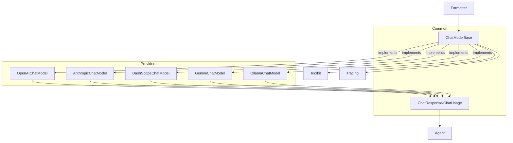

# SOP：src/agentscope/model 模块

## 一、功能定义（Scope/非目标）
### 1. 设计思路和逻辑
- 为不同厂商的聊天模型提供统一的异步接口，屏蔽 SDK 差异，让 Agent 只关心 `ChatResponse`/`ChatUsage` 结构。
- 解决三类差异：流式与非流式返回、工具调用分片、结构化输出（Pydantic 模型）与用量统计。
- 保持“纯适配”定位：不引入业务 Prompt、不实现复杂重试/降级策略，异常直接向上冒泡。

### 2. 架构设计

### 3. 核心组件逻辑
- `ChatModelBase.__call__` 统一入口：接收标准化的消息列表、工具 schema 与 `tool_choice`；当 `structured_model` 存在时进入结构化输出分支，其他参数交给具体实现。
- 流式解析：各实现维护累积缓冲，将 reasoning/text/audio/tool_calls 切片组装成增量 `ChatResponse`，并在结束时补全 `usage`。
- 非流式解析：一次性发送请求并解析响应，生成包含所有内容块、工具调用和 `ChatUsage` 的 `ChatResponse`。
- 结构化输出：通过 `_create_tool_from_base_model` 把 Pydantic 模型转换为强制调用的“完成函数”，把解析后的 `parsed`/`parsed_output` 写入 `ChatResponse.metadata`。
- 工具协议：对 Formatter 生成的 JSON schema 原样透传；`tool_choice` 支持 `"auto"|"none"|"any"|"required"|函数名`，并由 `_validate_tool_choice` 校验。
- 用量统计：以 `ChatUsage` 表示输入/输出 token 和耗时；耗时通常在调用前后用 `datetime.now()` 计算。

### 4. 关键设计模式
- **适配器模式**：每个具体模型类适配各自 SDK，统一输出 `ChatResponse`。
- **生成器/异步迭代器**：流式调用通过 `AsyncGenerator[ChatResponse]` 暴露增量数据。
- **策略模式**：`tool_choice` 与 `structured_model` 控制输出策略；`generate_kwargs`/`client_kwargs` 允许注入额外配置。
- **装饰器**：`@trace_llm` 记录调用的输入/输出和异常（OpenTelemetry）。

### 5. 其他组件的交互
- **Formatter**：必须保证输入消息、工具 schema 与模型提供方兼容；模型层不修改消息结构。
- **Agent**：消费 `ChatResponse.content`、`ChatResponse.metadata` 和 `ChatUsage`，并决定如何处理流式分片与结构化结果。
- **Toolkit**：工具 schema/调用限制依赖模型 API 能力；模型层只校验 `tool_choice`，实际工具选择由 LLM 决定。
- **Tracing**：`trace_llm`/`trace` 装饰器写入 OpenTelemetry span，错误直接记录后抛出。
- **错误处理**：网络/鉴权错误由 SDK 抛出，模型层不捕获；业务层负责重试与回退。

## 二、文件/类/函数/成员变量映射到 src 路径
- `src/agentscope/model/_model_base.py`
  - `ChatModelBase`：基类，属性 `model_name`、`stream`；抽象方法 `__call__`；工具校验 `_validate_tool_choice`。
  - `TOOL_CHOICE_MODES`：允许的工具选择字符串。
- `src/agentscope/model/_model_response.py` / `_model_usage.py`
  - `ChatResponse`：内容块、创建时间、唯一 id、usage、metadata。
  - `ChatUsage`：`input_tokens`、`output_tokens`、`time`。
  - 均继承 `DictMixin`，支持 dict 风格访问。
- `src/agentscope/model/_openai_model.py`
  - `OpenAIChatModel`：封装 `openai.AsyncClient`；处理流式/非流式/结构化输出；解析 reasoning/audio/tool 调用。
  - 重要方法：`_parse_openai_completion_response`、`_parse_openai_stream_response`。
- `src/agentscope/model/_anthropic_model.py`
  - `AnthropicChatModel`：适配 Anthropic Messages API；结构化输出通过工具注入；处理思维内容与工具分片。
- `src/agentscope/model/_dashscope_model.py`
  - `DashScopeChatModel`：适配阿里云 DashScope；支持思维链与多模态字段映射。
- `src/agentscope/model/_gemini_model.py`
  - `GeminiChatModel`：封装 Google Gemini，处理文本和多模态输入/输出。
- `src/agentscope/model/_ollama_model.py`
  - `OllamaChatModel`：本地模型接口；流式文本解析、结构化 JSON 解析通过 `_json_loads_with_repair`。
- `src/agentscope/model/_model_response.py`
  - `ChatResponse`/`ChatUsage` 数据结构（见上）。
- `src/agentscope/model/__init__.py`
  - 导出所有模型类与响应数据结构。

## 三、关键数据结构与对外接口（含类型/返回约束）
- `ChatModelBase.__call__(messages: list[dict], tools: list[dict] | None = None, tool_choice: str | None = None, structured_model: Type[BaseModel] | None = None, **kwargs) -> ChatResponse | AsyncGenerator[ChatResponse, None]`
  - `messages`：Formatter 构造的标准消息；`tools`：JSON schema 列表；`tool_choice` 校验后传给 SDK；`structured_model` 指定 Pydantic 输出模型。
  - 返回值：非流式为单个 `ChatResponse`；流式为异步生成器。调用者需判断类型。
- `ChatResponse`
  - `content: Sequence[TextBlock | ToolUseBlock | ThinkingBlock | AudioBlock]`
  - `usage: ChatUsage | None`、`metadata: dict[str, JSONSerializableObject] | None`、`id: str`、`created_at: str`。
  - `DictMixin` 支持属性/键访问。
- `ChatUsage`
  - `input_tokens: int`、`output_tokens: int`、`time: float`、`type: Literal["chat"]`。
- 各模型构造函数示例：
  - `OpenAIChatModel(model_name: str, api_key: str | None = None, stream: bool = True, reasoning_effort: Literal["low","medium","high"] | None = None, organization: str | None = None, client_kwargs: dict | None = None, generate_kwargs: dict[str, JSONSerializableObject] | None = None)`.
  - 其他模型有类似参数（DashScope 需要 `api_key` 与模型名；Gemini/Ollama/Anthropic 各自接受客户端配置）。
- 异常约束
  - `_validate_tool_choice` 若传入非法字符串，将抛 `TypeError` 或 `ValueError`。
  - SDK 抛出的网络/鉴权错误未经处理直接冒泡。

## 四、与其他模块交互（调用链与责任边界）
- **标准调用链**：
  `Formatter.format` → `ChatModelBase.__call__` → （流式）多次 `ChatResponse` → Agent 聚合/决定下一步。
  在结构化场景，`ChatResponse.metadata` 供 Agent 校验并写入 `Msg.metadata`。
- **Toolkit**：若模型支持工具调用，Formatter 会提供 `tools` 列表；模型层仅负责传递和解析工具调用信息，`Toolkit.call_tool_function` 由 Agent 驱动。
- **Tracing**：`trace_llm` 装饰器会在调用前创建 span，记录输入、输出、异常和最终的使用量。
- **日志与调试**：模型层不写日志（除必要的错误信息）；建议调用方使用 Hook 或 Tracing 记录。
- **责任边界**：
  - 不负责 Prompt 模板、不做重试或降级；
  - 不缓存响应；
  - 结构化输出需由调用方提供合法的 Pydantic 模型。

## 五、测试文件
- 绑定文件：`tests/model_openai_test.py`、`tests/model_dashscope_test.py`、`tests/model_gemini_test.py`、`tests/model_anthropic_test.py`、`tests/model_ollama_test.py`
- 覆盖点：流式/非流式解析、工具调用分片、tool_choice 校验、结构化输出 `metadata`、usage 统计。
