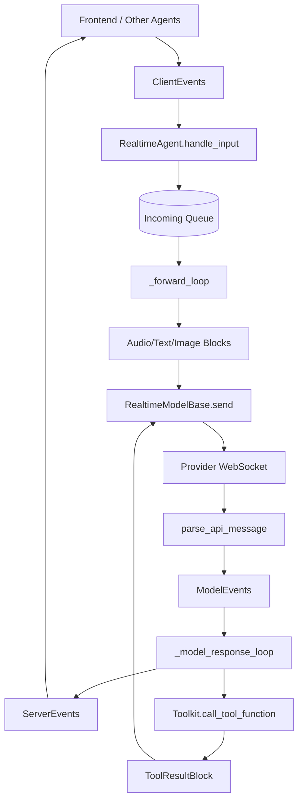

# SOP：src/agentscope/realtime 模块

## 一、功能定义（Scope/非目标）
### 1. 设计思路和逻辑
- 为低时延语音/多模态会话提供统一的实时模型抽象，把 OpenAI / Gemini / DashScope 的 provider 协议归一到 AgentScope 自己的事件模型。
- 将“WebSocket 连接与 provider 协议细节”和“Agent 编排/工具执行”分层：`RealtimeModelBase` 负责连接与协议适配，`RealtimeAgent` 负责输入转发、事件映射和工具回灌。
- 目标是让前端和上层服务只处理统一的 `ClientEvents` / `ServerEvents` / `ModelEvents`，而不是直接面向 provider 原始 payload。
- 非目标：本模块不负责 UI 会话状态、浏览器播放策略、长期记忆编排，也不在 import-time 建立外部连接。

### 2. 架构设计

### 3. 核心组件逻辑
- **连接建立**：`RealtimeModelBase.connect` 负责打开 WebSocket、发送 provider session config，并启动 `_receive_model_event_loop` 把原始消息解析成统一 `ModelEvents`。
- **Provider 适配**：
  - `OpenAIRealtimeModel`：把常规 Toolkit schema 改写为 Realtime API 需要的扁平 `{"type": "function", ...}` 结构，并解析 `response.*` / `conversation.item.*` 事件。
  - `GeminiRealtimeModel`：兼容 Gemini Live 的 turn / inline data / tool call 结构，把图片、音频、文本与工具调用统一回 `ModelEvents`。
  - `DashScopeRealtimeModel`：处理 Qwen Omni Realtime 的 session、音频、图片与工具回包格式。
- **事件标准化**：`ClientEvents` 表达前端输入，`ModelEvents` 表达 provider 统一输出，`ServerEvents` 表达后端发回前端或其他 Agent 的事件；`ServerEvents.from_model_event` 负责主要映射。
- **工具协作**：实时 provider 发出完整 `tool_use` 后，`RealtimeAgent._acting` 调用 Toolkit 执行，再把 `ToolResultBlock` 同时发回 provider 与外部消费者。
- **音频兼容**：当外部输入采样率与 provider 固定采样率不一致时，`RealtimeAgent` 通过 `_resample_pcm_delta` 做 PCM16 重采样，减少 provider 拒收或音频畸变。

### 4. 关键设计模式
- **适配器模式**：每个 provider 模型把私有协议适配到统一 `ModelEvents`。
- **事件驱动模式**：前端、Agent、provider 之间通过事件和异步队列解耦。
- **模板方法**：`RealtimeModelBase` 固定连接/接收循环骨架，provider 子类只实现 `send`、`_build_session_config`、`parse_api_message`。
- **双向桥接**：`RealtimeAgent` 一端面向统一事件，一端面向消息块和 Toolkit，承担协议桥梁角色。

### 5. 其他组件的交互
- **Agent**：`RealtimeAgent` 是本模块最直接的上游消费者，负责把事件转发到实时模型，并把模型事件再发布为 `ServerEvents`。
- **Toolkit**：Realtime session 初始化时消费 `Toolkit.get_json_schemas()`；完整工具调用完成后经 Toolkit 执行并产出 `ToolResultBlock`。
- **Message**：输入输出内容统一使用 `AudioBlock`、`TextBlock`、`ImageBlock`、`ToolUseBlock`、`ToolResultBlock`。
- **Utils**：依赖 `_get_bytes_from_web_url` 拉取远端图片/音频资源，依赖 `_resample_pcm_delta` 做音频重采样。

## 二、文件/类/函数/成员变量映射到 src 路径
- `src/agentscope/realtime/__init__.py`
  - 导出 `RealtimeModelBase`、三种 provider 模型、`ClientEvents` / `ModelEvents` / `ServerEvents` 及其类型枚举。
- `src/agentscope/realtime/_base.py`
  - `RealtimeModelBase`：统一连接、断连、消息接收循环；公开 `connect`、`disconnect`、抽象 `send`、抽象 `parse_api_message`。
  - 维护 `_websocket`、`_incoming_task`，并在 `connect` 时写入 provider session config。
- `src/agentscope/realtime/_openai_realtime_model.py`
  - `OpenAIRealtimeModel`：OpenAI Realtime API 适配器；关键方法 `_format_toolkit_schema`、`_parse_audio_data`、`_parse_text_data`、`_parse_tool_result_data`。
  - 内部维护 `_response_id` 与 `_tool_args_accumulator`，把参数增量聚合成完整 `ToolUseBlock`。
- `src/agentscope/realtime/_gemini_realtime_model.py`
  - `GeminiRealtimeModel`：Gemini Live API 适配器；补充 `inline_data`、`server_content`、tool call、图片输入等转换逻辑。
- `src/agentscope/realtime/_dashscope_realtime_model.py`
  - `DashScopeRealtimeModel`：DashScope/Qwen Realtime API 适配器；支持文本、图片、音频输入与 provider 事件解析。
- `src/agentscope/realtime/_events/_client_event.py`
  - `ClientEventType`、`ClientEvents`：建模前端输入，如 `ClientTextAppendEvent`、`ClientAudioAppendEvent`、`ClientToolResultEvent`。
- `src/agentscope/realtime/_events/_model_event.py`
  - `ModelEventType`、`ModelEvents`：建模 provider 输出，如 response 创建/完成、音频 delta、转写、tool-use、错误事件。
- `src/agentscope/realtime/_events/_server_event.py`
  - `ServerEventType`、`ServerEvents`：建模后端输出；`from_model_event` 把统一 `ModelEvents` 映射为 `ServerEvents`。
- `src/agentscope/realtime/_events/_utils.py`
  - `AudioFormat`：统一音频 MIME + 采样率结构。

## 三、关键数据结构与对外接口（含类型/返回约束）
- `RealtimeModelBase.connect(outgoing_queue: Queue, instructions: str, tools: list[dict] | None = None) -> None`
  - 打开 provider WebSocket、发送 session config，并启动消息接收循环。
  - 异常语义：连接失败或握手失败直接向上抛出。
- `RealtimeModelBase.send(data: AudioBlock | TextBlock | ImageBlock | ToolResultBlock) -> None`
  - provider 子类必须实现；只在已经连接时可调用，否则抛 `RuntimeError`。
- `RealtimeModelBase.parse_api_message(message: str) -> ModelEvents.EventBase | list[ModelEvents.EventBase] | None`
  - provider 子类必须实现；负责把原始 payload 转成统一事件，无法识别时可返回 `None`。
- `ClientEvents`
  - 代表前端输入；常用类型包括 `ClientTextAppendEvent`、`ClientAudioAppendEvent`、`ClientImageAppendEvent`、`ClientToolResultEvent`。
  - 通过 `ClientEvents.from_json(json_data: dict) -> ClientEvents.EventBase` 做反序列化；未知 `type` 抛 `ValueError`。
- `ModelEvents`
  - 代表 provider 统一输出；关键事件族包括 `ModelResponseCreatedEvent`、`ModelResponseAudioDeltaEvent`、`ModelResponseToolUseDoneEvent`、`ModelInputTranscriptionDoneEvent`、`ModelErrorEvent`。
- `ServerEvents`
  - 代表后端对外输出；关键事件族包括 `AgentReadyEvent`、`AgentResponseAudioDeltaEvent`、`AgentResponseToolUseDoneEvent`、`AgentResponseToolResultEvent`、`AgentErrorEvent`。
  - `ServerEvents.from_model_event(event, agent_id: str, agent_name: str) -> ServerEvents.EventBase` 负责大部分模型事件到后端事件的映射。
- `AudioFormat`
  - 字段：`type: str`、`rate: int`；用于音频块与音频事件间保持采样率和 MIME 一致。

## 四、与其他模块交互（调用链与责任边界）
- **典型调用链**
  - 前端/其他 Agent → `ClientEvents` → `RealtimeAgent.handle_input` → `RealtimeModelBase.send`
  - provider WebSocket → `parse_api_message` → `ModelEvents` → `RealtimeAgent._model_response_loop` → `ServerEvents`
  - provider `tool_use done` → `RealtimeAgent._acting` → `Toolkit.call_tool_function` → `ToolResultBlock` → provider + 前端
- **责任边界**
  - `realtime` 模块负责协议适配与事件标准化，不负责 UI 播放开关、浏览器权限或会话持久化。
  - `RealtimeAgent` 负责队列编排和工具回灌，不负责 provider 私有协议细节。
  - Toolkit 负责 schema 暴露和工具执行，不关心实时 provider 的事件格式。
  - Message 模块负责多模态块的数据结构定义，`realtime` 只消费这些类型。

## 五、测试文件
- 绑定文件：`tests/realtime_event_test.py`、`tests/realtime_openai_test.py`、`tests/realtime_gemini_test.py`、`tests/realtime_dashscope_test.py`、`tests/public_surface_test.py`、`tests/init_import_test.py`
- 覆盖点：事件反序列化与映射、OpenAI/Gemini/DashScope provider 协议解析、Realtime toolkit schema 格式兼容、顶层 `agentscope.realtime` 暴露、缺失 runtime 依赖时的 import-safety。
